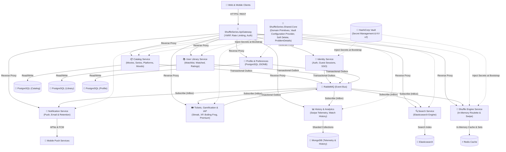
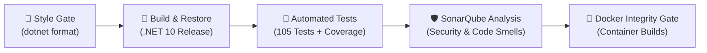

# 🎬 ShuffleSeries.Microservices

ShuffleSeries is a distributed, high-performance, and resilient microservices platform designed to provide smart, randomized content selection ("shuffle") across movies, series, and standalone episodes (such as *Black Mirror* or *Love, Death & Robots*).

Built with **.NET 10** and **C# 14**, the platform adheres to **Clean Architecture (Onion Architecture)**, **Domain-Driven Design (DDD)**, **CQRS**, and **Event-Driven Architecture**.

---

## 🏛️ System Architecture

The following diagram illustrates the high-level architecture and communication patterns across ShuffleSeries services:



---

## 🔄 Closed-Loop Event Choreography Matrix

ShuffleSeries leverages a decentralized **Event Choreography** pattern over RabbitMQ. To eliminate distributed data inconsistencies and temporal coupling:
- **Publishers** commit domain events alongside their transactional state using the **Transactional Outbox Pattern**.
- **Consumers** process incoming messages with idempotency guarantees using the **InBox Pattern**.
- Every published event has explicit, purposeful consumers—guaranteeing a **closed-loop event matrix** with zero orphaned events.

```mermaid
flowchart TD
    classDef pub fill:#1e293b,stroke:#38bdf8,stroke-width:2px,color:#fff;
    classDef evt fill:#0f172a,stroke:#fbbf24,stroke-width:1.5px,color:#fef08a;
    classDef sub fill:#1e293b,stroke:#4ade80,stroke-width:2px,color:#fff;

    subgraph FLOW_IDENTITY ["1️⃣ Identity & Account Lifecycle Stream"]
        direction LR
        P_ID["🔑 Identity Service\n(Outbox Publisher)"]:::pub -->|"Publishes"| E_ID["UserRegisteredEvent\nUserMergedEvent\nUserAccountDeletedEvent"]:::evt
        E_ID -->|"InBox"| C_ID1["🔔 Notification (Welcome Email)"]:::sub
        E_ID -->|"InBox"| C_ID2["🎟️ Tickets & Gamification (Init 14d Quota)"]:::sub
        E_ID -->|"InBox"| C_ID3["👤 Profile (Create Initial Profile)"]:::sub
        E_ID -->|"InBox"| C_ID4["📚 User Library (Merge Guest Watchlist)"]:::sub
        E_ID -->|"InBox"| C_ID5["📊 Analytics (GDPR Anonymization)"]:::sub
    end

    subgraph FLOW_CATALOG ["2️⃣ Content Catalog & Metadata Synchronization Stream"]
        direction LR
        P_CAT["📦 Catalog Service\n(Outbox Publisher)"]:::pub -->|"Publishes"| E_CAT["MediaCreated / Updated / Deleted\nPlatformUpdatedEvent\nMoodUpdatedEvent"]:::evt
        E_CAT -->|"InBox"| C_CAT1["🎲 Shuffle Engine (Redis Cache Sync)"]:::sub
        E_CAT -->|"InBox"| C_CAT2["🔍 Search Service (Elasticsearch Index)"]:::sub
        E_CAT -->|"InBox"| C_CAT3["🔔 Notification (New Media Push)"]:::sub
    end

    subgraph FLOW_SWIPE ["3️⃣ Swipe Arena & Real-Time Action Stream"]
        direction LR
        P_SHUF["🎲 Shuffle Engine\n(Outbox Publisher)"]:::pub -->|"Publishes"| E_SWIPE["ShuffleSwipedEvent\n(Action: Skip / Save, DwellTime)"]:::evt
        E_SWIPE -->|"InBox"| C_SWP1["🎟️ Tickets (Deduct 1 Ticket on Skip)"]:::sub
        E_SWIPE -->|"InBox"| C_SWP2["📊 Analytics (Dwell Time & Swipe Log)"]:::sub
    end

    subgraph FLOW_LIBRARY ["4️⃣ User Library, Watch & Rating Stream"]
        direction LR
        P_LIB["📚 User Library\n(Outbox Publisher)"]:::pub -->|"Publishes"| E_LIB["MediaAddedToWatchlistEvent\nMediaWatchedEvent\nMediaRatedEvent (3-State)"]:::evt
        E_LIB -->|"InBox"| C_LIB1["🎟️ Tickets (+3 Tickets per 3 Ratings)"]:::sub
        E_LIB -->|"InBox"| C_LIB2["🔍 Search (Trending Roulettes Count)"]:::sub
        E_LIB -->|"InBox"| C_LIB3["📊 Analytics (Watch History & Recs)"]:::sub
    end

    subgraph FLOW_PREMIUM ["5️⃣ Gamification & Premium Subscription Stream"]
        direction LR
        P_GAM["🎟️ Tickets & Gamification\n(Outbox Publisher)"]:::pub -->|"Publishes"| E_GAM["UserSubscribed / Cancelled\nBadgeUnlocked / LevelUp\nTicketBalanceExhausted"]:::evt
        E_GAM -->|"InBox"| C_GAM1["🎲 Shuffle Engine (Redis Premium Unlock)"]:::sub
        E_GAM -->|"InBox"| C_GAM2["🔔 Notification (Badge & VIP Push)"]:::sub
        E_GAM -->|"InBox"| C_GAM3["👤 Profile (Update Active Title)"]:::sub
        E_GAM -->|"InBox"| C_GAM4["📊 Analytics (IAP Conversion Telemetry)"]:::sub
    end

    subgraph FLOW_PROFILE ["6️⃣ User Preferences Invalidation Stream"]
        direction LR
        P_PROF["👤 Profile Service\n(Outbox Publisher)"]:::pub -->|"Publishes"| E_PROF["ProfileUpdatedEvent\n(Genres / Platforms Changed)"]:::evt
        E_PROF -->|"InBox"| C_PROF1["🎲 Shuffle Engine (Invalidate Cached Pool)"]:::sub
    end
```



### 📋 Event Choreography Routing Matrix

| Stream / Pipeline | Publisher (Outbox) | Published Domain Events | InBox Consumers (Subscribers) | Architectural Function |
| :--- | :--- | :--- | :--- | :--- |
| **1. Identity & Auth** | `Identity Service` | `UserRegisteredEvent`<br>`UserMergedEvent`<br>`UserAccountDeletedEvent` | • `Notification Service`<br>• `Tickets & Gamification`<br>• `Profile Service`<br>• `User Library`<br>• `History & Analytics` | Onboarding lifecycle, welcome emails, 14-day honeymoon quota allocation, guest session data merge, and GDPR right-to-be-forgotten cleanup. |
| **2. Catalog & Metadata** | `Catalog Service` | `MediaCreated/Updated/Deleted`<br>`PlatformUpdatedEvent`<br>`MoodUpdatedEvent` | • `Shuffle Engine`<br>• `Search Service`<br>• `Notification Service` | Instant Redis memory-set synchronization, Elasticsearch index updates with platform/mood facets, and push alerts for favorite genres. |
| **3. Swipe Arena** | `Shuffle Engine` | `ShuffleSwipedEvent` | • `Tickets & Gamification`<br>• `History & Analytics` | Real-time asynchronous ticket deduction on pass/skip without blocking the UI, plus dwell-time telemetry logging. |
| **4. User Library** | `User Library` | `MediaAddedToWatchlist`<br>`MediaWatchedEvent`<br>`MediaRatedEvent` | • `Tickets & Gamification`<br>• `Search Service`<br>• `History & Analytics` | Awarding +3 tickets on every 3 ratings, updating "Trending Roulettes" daily counts, and chronological watch history tracking. |
| **5. Gamification & IAP** | `Tickets & Gamification` | `UserSubscribed/Cancelled`<br>`BadgeUnlockedEvent`<br>`LevelUpEvent`<br>`TicketBalanceExhausted` | • `Shuffle Engine`<br>• `Notification Service`<br>• `Profile Service`<br>• `History & Analytics` | Real-time Redis entitlement caching (unlocking "My-List Shuffle" and VIP Arenas), celebration badge push notifications, and revenue analytics. |
| **6. Profile & Settings** | `Profile Service` | `ProfileUpdatedEvent` | • `Shuffle Engine` | Immediate invalidation of pre-computed in-memory shuffle pools when user changes platforms or genres. |

---

## 🧩 Solution Structure

```
├── ShuffleSeries.Shared.Core/          # Reusable foundational library for all microservices
│   ├── ShuffleSeries.Shared.Core.Domain/          # BaseEntity, AggregateRoot, Domain Events, Repositories
│   ├── ShuffleSeries.Shared.Core.Exceptions/      # CustomException hierarchy (Business, NotFound, Conflict, etc.)
│   ├── ShuffleSeries.Shared.Core.Application/     # Common DTOs (ApiResponse, PaginationRequest, PaginatedList)
│   ├── ShuffleSeries.Shared.Core.Infrastructure/  # EF Core Interceptors (Outbox messaging)
│   ├── ShuffleSeries.Shared.Core.Web/             # RFC 9457 GlobalExceptionHandler, ProblemDetails
│   └── ShuffleSeries.Shared.Core.Tests/           # Unit test suite for shared core primitives
├── ShuffleSeries.Catalog/              # Catalog bounded context
│   ├── ShuffleSeries.Catalog.Domain/
│   ├── ShuffleSeries.Catalog.Application/
│   ├── ShuffleSeries.Catalog.Infrastructure/
│   ├── ShuffleSeries.Catalog.Api/
│   └── ShuffleSeries.Catalog.Tests/
├── ShuffleSeries.ApiGateway/           # YARP-based intelligent API Gateway
└── docs/                               # Architectural documentation, roadmaps, and task guides
    ├── roadmap.md                      # Milestone & task tracking
    ├── lessons.md                      # Knowledge base of architectural decisions & lessons learned
    └── tasks/                          # Educational documentation for each milestone task
```

---

## 🛠️ Technology Stack

| Category | Technology |
| :--- | :--- |
| **Framework & Language** | .NET 10, C# 14 |
| **Architecture** | Onion Architecture, Domain-Driven Design (DDD), CQRS |
| **API & Networking** | Minimal APIs, YARP API Gateway, gRPC |
| **API Documentation** | OpenAPI v3 (Microsoft.AspNetCore.OpenApi), Swagger UI, Scalar API Reference |
| **Event Streaming** | RabbitMQ (Outbox & InBox patterns for guaranteed delivery) |
| **Databases & Stores** | PostgreSQL, MongoDB, Redis, Elasticsearch |
| **Secret Management** | HashiCorp Vault (KV-v2 engine, automated seeding) |
| **Resilience** | Polly (Retry, Circuit Breaker, Fallback) |
| **Observability** | OpenTelemetry, Serilog, Prometheus, Jaeger |
| **Testing** | xUnit, FluentAssertions, Moq, Coverlet |
| **CI/CD & Quality** | GitHub Actions, SonarQube / SonarCloud, Docker Buildx |

---

## 🧱 Shared.Core Building Blocks

`ShuffleSeries.Shared.Core` provides enterprise-grade abstractions across every microservice:

### 1. Domain Primitives (`ShuffleSeries.Shared.Core.Domain`)
- **`BaseEntity<TId>` & `BaseEntity`**: Identity-based equality, operator overloads (`==`, `!=`), audit fields, and built-in `ISoftDeletable` and `IHardDeletable` implementations.
- **`ISoftDeletable`**: Domain contract defining `IsDeleted`, `DeletedAtUtc`, `DeletedBy`, and domain-driven soft delete operations.
- **`IHardDeletable`**: Dedicated interface for explicit physical hard-delete intent (`IsHardDeleteRequested`, `HardDelete()`).
- **`AggregateRoot<TId>` & `AggregateRoot`**: Generic DDD Aggregate Root base class supporting any primary key type (`Guid`, `string`), encapsulating domain event publishing (`RaiseDomainEvent`, `ClearDomainEvents`).
- **`IAggregateRoot`**: Universal interface abstracting domain event collection for outbox interceptors across diverse storage backends.
- **`IDomainEvent`**: Core event contract for cross-boundary event propagation.

### 2. Standardized Exceptions (`ShuffleSeries.Shared.Core.Exceptions`)
- **`CustomException`**: Abstract base exception carrying `HttpStatusCode`, machine-readable `Code`, and human-readable `Title`.
- **`BadRequestException`**: HTTP 400 for client contract mismatches, malformed IDs, or parameter violations.
- **`BusinessException`**: HTTP 422 for domain rule violations.
- **`NotFoundException`**: HTTP 404 for missing resources, with `(entityName, key)` formatting.
- **`ValidationException`**: HTTP 400 for FluentValidation failure dictionaries.
- **`ConflictException`**: HTTP 409 for duplicate key / conflicting states.
- **`UnauthorizedException` & `ForbiddenException`**: HTTP 401 and HTTP 403 access control exceptions.
- **`InternalServerException`**: HTTP 500 for internal server failures.

### 3. Production-Ready ProblemDetails (`ShuffleSeries.Shared.Core.Web`)
- **`GlobalExceptionHandler`**: ASP.NET Core `IExceptionHandler` implementation adhering to RFC 7807 and RFC 9457 with `Response.HasStarted` resilience.
- **Observability**: Automatically enriches error responses with `traceId` (`Activity.Current?.Id ?? HttpContext.TraceIdentifier`).
- **Security by Design (OWASP API8)**: Masks sensitive internal stack traces in non-development environments while maintaining detailed structured logging.

### 4. Centralized CORS Management (`ShuffleSeries.Shared.Core.Web`)
- **`AddSharedCors` & `UseSharedCors`**: Extension methods enabling environment-aware CORS. Enforces strict `Cors:AllowedOrigins` and credentials when configured in production; seamlessly falls back to permissive development mode for local development and Swagger UI exploration.

### 5. Common DTOs (`ShuffleSeries.Shared.Core.Application`)
- **`PaginatedList<T>`**: Immutable, paginated result set with seamless `System.Text.Json` deserialization (`[JsonConstructor]`).
- **`PaginationRequest`**: Centralized single source of truth for pagination; clamps bounds (1 to 100) and calculates SQL `Skip` (OFFSET) and `Take` (LIMIT) automatically.
- **`ApiResponse<T>` & `ApiResponse`**: Standardized response envelope model.

### 6. Infrastructure, Soft Delete, Hard Delete & Pagination (`ShuffleSeries.Shared.Core.Infrastructure`)
- **`QueryablePaginationExtensions`**: EF Core extensions (`ApplyPagination`, `ToPaginatedListAsync`) that apply safe pagination directly to `IQueryable` without manual offset math.
- **`SoftDeleteInterceptor`**: EF Core `SaveChangesInterceptor` that intercepts entity deletions (`EntityState.Deleted`) and transforms them into soft-deleted state updates (`EntityState.Modified`) with UTC timestamps.
- **`HardDeleteScope`**: Ambient `AsyncLocal<bool>` scope (`using (HardDeleteScope.Begin())`) allowing explicit physical deletions (e.g. GDPR, Apple Account Deletion, Retention Purges) by bypassing the soft-delete interceptor cleanly.
- **Domain `HardDelete()`**: Entity-level intent marker (`entity.HardDelete()`) that instructs the interceptor to permit physical deletion of that specific entity instance.
- **`ModelBuilderExtensions`**: Dynamically registers Global Query Filters (`e => !e.IsDeleted`) across all `ISoftDeletable` entities via Expression Trees (supporting `.IgnoreQueryFilters()`).
- **`InsertOutboxMessagesInterceptor`**: Collects and serializes uncommitted aggregate domain events into the transactional `OutboxMessages` table atomically.

### 7. Secret Management & Vault Configuration Provider (`ShuffleSeries.Shared.Core.Infrastructure`)
- **`VaultConfigurationProvider`**: Native, `HttpClient`-based .NET `ConfigurationProvider` that securely pulls secrets from HashiCorp Vault KV-v2 (`/v1/{mount}/data/{path}`) during bootstrap.
- **Hierarchical Path Support**: Transparently reads and merges shared infrastructure secrets (`shuffleseries/shared`) with microservice-specific secrets (`shuffleseries/{serviceName}`).
- **Key Normalization & Nested JSON**: Automatically normalizes double underscores (`__`) and nested JSON structures into standard .NET `Section:Key` configuration paths.
- **Secret-Free `appsettings.json`**: Removes all plaintext passwords and connection strings from source control in strict adherence to OWASP API8.

### 8. OpenAPI, Swagger & Scalar Documentation (`ShuffleSeries.Shared.Core.Web`)
- **`AddSharedSwagger` & `UseSharedSwagger`**: Single-line extension methods configuring native .NET 10 OpenAPI document generation, classic Swagger UI, and modern Scalar documentation.
- **`OpenApiSecurityDocumentTransformer`**: Automatically instruments OpenAPI documents with JWT Bearer security schemes (`Bearer {token}`) for seamless interactive authentication.
- **Dual UI Support**: Simultaneously exposes `/swagger` (classic Swagger UI) and `/scalar/v1` (modern high-performance Scalar API Reference) backed by the same `/openapi/v1.json` specification.

---

## 🚀 Getting Started & Testing

### Prerequisites
- [.NET 10 SDK](https://dotnet.microsoft.com/download)
- [Docker Desktop](https://www.docker.com/products/docker-desktop/) (Docker Compose v2+)

### 🐳 Local Infrastructure Setup (Docker Compose)
All backing infrastructure services (PostgreSQL, MongoDB, Redis, Elasticsearch, RabbitMQ) are orchestrated via a single, production-grade `docker-compose.yml`. Microservice development runs directly via IDE (Rider / Visual Studio / VS Code) against these backing services.

1. **Configure Environment Variables:**
   ```bash
   cp .env.example .env
   ```

2. **Start All Infrastructure Services:**
   ```bash
   docker compose up -d
   ```

3. **Verify Service Health:**
   ```bash
   docker compose ps
   ```

| Service | Container Name | Host Port | Management UI / API | Default Credentials | Description |
| :--- | :--- | :--- | :--- | :--- | :--- |
| **🐘 PostgreSQL** | `shuffleseries_postgres` | `5432` | `localhost:5432` | `admin` / `SuperSecretSecurePassword2026!!` | Relational store (Catalog, Identity, Outbox) |
| **🍃 MongoDB** | `shuffleseries_mongodb` | `27017` | `localhost:27017` | `admin` / `SuperSecretMongoPassword2026!!` | NoSQL document store (History & Analytics) |
| **⚡ Redis** | `shuffleseries_redis` | `6379` | `localhost:6379` | Auth: `SuperSecretRedisPassword2026!!` | In-memory cache, Shuffle store & Blacklist |
| **🔎 Elasticsearch** | `shuffleseries_elasticsearch` | `9200`, `9300` | `http://localhost:9200` | Single-node (Security disabled locally) | Search engine, autocomplete & indexing |
| **📨 RabbitMQ** | `shuffleseries_rabbitmq` | `5672`, `15672` | `http://localhost:15672` | `guest_123` / `guest_123` | Message broker & Web Management console |
| **🔐 HashiCorp Vault** | `shuffleseries_vault` | `8200` | `http://localhost:8200` | Token: `root` | Centralized secrets engine & configuration store |

### 🚢 Running Full Application Stack in Docker (`docker-compose.apps.yml`)
To run both the backing infrastructure and application microservices (`Catalog.Api` and `ApiGateway`) fully containerized (e.g. for E2E testing or staging):
```bash
docker compose -f docker-compose.yml -f docker-compose.apps.yml up -d --build
```
This boots:
- `shuffleseries_catalog_api` on port `5000` (`http://localhost:5000/swagger`)
- `shuffleseries_api_gateway` on port `5001` (`http://localhost:5001/swagger`)
- All backing services connected via `shuffleseries_network`

To stop the application containers:
```bash
docker compose -f docker-compose.apps.yml down
```

4. **Stop Services:**
   ```bash
   docker compose down
   # To also wipe persistent data volumes:
   docker compose down -v
   ```

### 🔨 Build Solution
```bash
dotnet build
```

### 🧪 Run All Unit & Integration Tests
```bash
dotnet test
```

### 🏃 Run Catalog Service Locally
```bash
dotnet run --project ShuffleSeries.Catalog/ShuffleSeries.Catalog.Api
```
*(Automatically applies EF Core migrations to PostgreSQL, injects secrets from Vault, and starts MassTransit against RabbitMQ)*

#### 📖 Interactive API Documentation Endpoints
- **API Gateway Aggregated Swagger UI (All Services):** [http://localhost:5001/swagger](http://localhost:5001/swagger)
- **Catalog Scalar API Reference (Modern UI):** [http://localhost:5000/scalar/v1](http://localhost:5000/scalar/v1)
- **Catalog Swagger UI (Standalone):** [http://localhost:5000/swagger](http://localhost:5000/swagger)
- **Catalog OpenAPI v3 Specification:** [http://localhost:5000/openapi/v1.json](http://localhost:5000/openapi/v1.json)

---

## 🚀 Continuous Integration & Quality Gates (CI/CD)

The platform is fortified with an automated, multi-stage GitHub Actions pipeline (`.github/workflows/ci.yml`):



- **Clean Code Gate:** Automatically verifies code formatting (`dotnet format --verify-no-changes`).
- **Code Coverage & Quality:** Collects XPlat Code Coverage (Cobertura & OpenCover) and analyzes vulnerabilities via SonarScanner with Java 21 LTS runtime.
- **Container Verification:** Validates Docker builds for both `ShuffleSeries.Catalog.Api` and `ShuffleSeries.ApiGateway` on every push and pull request.

### 🛡️ Running SonarQube & Coverage Locally (Shift-Left Quality)
You can run the exact same SonarQube analysis and code coverage locally before pushing:
```bash
# Start SonarQube and run full test coverage analysis
./scripts/run-sonar.sh
```
Explore the local analysis dashboard at [http://localhost:9000/dashboard?id=ShuffleSeries.Microservices](http://localhost:9000/dashboard?id=ShuffleSeries.Microservices).
To stop SonarQube after analysis:
```bash
docker compose -f docker-compose.sonarqube.yml down
```

---

## 🗺️ Roadmap & Progress
Track current and upcoming milestones in [docs/roadmap.md](./docs/roadmap.md).
Architectural guidelines and lessons learned are documented in [docs/lessons.md](./docs/lessons.md).
Task-specific guides and architectural rationale can be found in [docs/tasks/](./docs/tasks/).