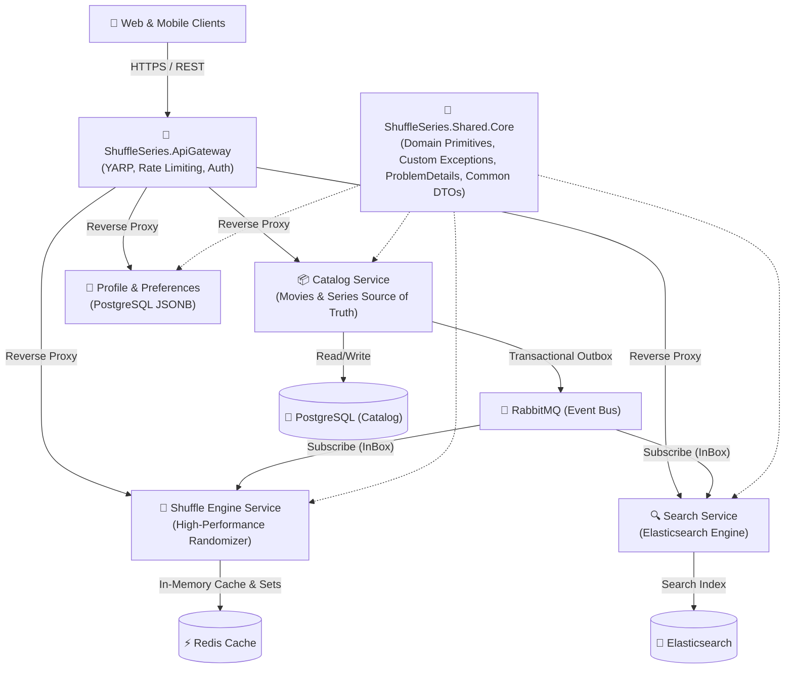

# 🎬 ShuffleSeries.Microservices

ShuffleSeries is a distributed, high-performance, and resilient microservices platform designed to provide smart, randomized content selection ("shuffle") across movies, series, and standalone episodes (such as *Black Mirror* or *Love, Death & Robots*).

Built with **.NET 10** and **C# 14**, the platform adheres to **Clean Architecture (Onion Architecture)**, **Domain-Driven Design (DDD)**, **CQRS**, and **Event-Driven Architecture**.

---

## 🏛️ System Architecture

The following diagram illustrates the high-level architecture and communication patterns across ShuffleSeries services:



---

## 🧩 Solution Structure

```
├── ShuffleSeries.Shared.Core/          # Reusable foundational library for all microservices
│   ├── ShuffleSeries.Shared.Core.Domain/          # BaseEntity, AggregateRoot, Domain Events, Repositories
│   ├── ShuffleSeries.Shared.Core.Exceptions/      # CustomException hierarchy (Business, NotFound, Conflict, etc.)
│   ├── ShuffleSeries.Shared.Core.Application/     # Common DTOs (ApiResponse, PaginationRequest, PaginatedList)
│   ├── ShuffleSeries.Shared.Core.Infrastructure/  # EF Core Interceptors (Outbox messaging)
│   ├── ShuffleSeries.Shared.Core.Web/             # RFC 9457 GlobalExceptionHandler, ProblemDetails
│   └── ShuffleSeries.Shared.Core.Tests/           # Unit test suite for shared core primitives
├── ShuffleSeries.Catalog/              # Catalog bounded context
│   ├── ShuffleSeries.Catalog.Domain/
│   ├── ShuffleSeries.Catalog.Application/
│   ├── ShuffleSeries.Catalog.Infrastructure/
│   ├── ShuffleSeries.Catalog.Api/
│   └── ShuffleSeries.Catalog.Tests/
├── ShuffleSeries.ApiGateway/           # YARP-based intelligent API Gateway
└── docs/                               # Architectural documentation, roadmaps, and task guides
    ├── roadmap.md                      # Milestone & task tracking
    ├── lessons.md                      # Knowledge base of architectural decisions & lessons learned
    └── tasks/                          # Educational documentation for each milestone task
```

---

## 🛠️ Technology Stack

| Category | Technology |
| :--- | :--- |
| **Framework & Language** | .NET 10, C# 14 |
| **Architecture** | Onion Architecture, Domain-Driven Design (DDD), CQRS |
| **API & Networking** | Minimal APIs, YARP API Gateway, gRPC |
| **Event Streaming** | RabbitMQ (Outbox & InBox patterns for guaranteed delivery) |
| **Databases & Stores** | PostgreSQL, MongoDB, Redis, Elasticsearch |
| **Resilience** | Polly (Retry, Circuit Breaker, Fallback) |
| **Observability** | OpenTelemetry, Serilog, Prometheus, Jaeger |
| **Testing** | xUnit, FluentAssertions, Moq, Coverlet |

---

## 🧱 Shared.Core Building Blocks

`ShuffleSeries.Shared.Core` provides enterprise-grade abstractions across every microservice:

### 1. Domain Primitives (`ShuffleSeries.Shared.Core.Domain`)
- **`BaseEntity<TId>` & `BaseEntity`**: Identity-based equality, operator overloads (`==`, `!=`), and audit fields (`CreatedAtUtc`, `CreatedBy`, `ModifiedAtUtc`, `ModifiedBy`, `DeletedAtUtc`, `DeletedBy`).
- **`AggregateRoot`**: Encapsulates domain event publishing (`RaiseDomainEvent`, `ClearDomainEvents`).
- **`IDomainEvent`**: Core event contract for cross-boundary event propagation.

### 2. Standardized Exceptions (`ShuffleSeries.Shared.Core.Exceptions`)
- **`CustomException`**: Abstract base exception carrying `HttpStatusCode`, machine-readable `Code`, and human-readable `Title`.
- **`BusinessException`**: HTTP 422 for domain rule violations.
- **`NotFoundException`**: HTTP 404 for missing resources, with `(entityName, key)` formatting.
- **`ValidationException`**: HTTP 400 for FluentValidation failure dictionaries.
- **`ConflictException`**: HTTP 409 for duplicate key / conflicting states.
- **`UnauthorizedException` & `ForbiddenException`**: HTTP 401 and HTTP 403 access control exceptions.
- **`InternalServerException`**: HTTP 500 for internal server failures.

### 3. Production-Ready ProblemDetails (`ShuffleSeries.Shared.Core.Web`)
- **`GlobalExceptionHandler`**: ASP.NET Core `IExceptionHandler` implementation adhering to RFC 7807 and RFC 9457.
- **Observability**: Automatically enriches error responses with `traceId` (`Activity.Current?.Id ?? HttpContext.TraceIdentifier`).
- **Security by Design (OWASP API8)**: Masks sensitive internal stack traces in non-development environments while maintaining detailed structured logging.

### 4. Common DTOs (`ShuffleSeries.Shared.Core.Application`)
- **`PaginatedList<T>`**: Immutable, paginated result set with seamless `System.Text.Json` deserialization (`[JsonConstructor]`).
- **`PaginationRequest`**: Normalized query parameter object with safe boundary clamping.
- **`ApiResponse<T>` & `ApiResponse`**: Standardized response envelope model.

---

## 🚀 Getting Started & Testing

### Prerequisites
- [.NET 10 SDK](https://dotnet.microsoft.com/download)
- Docker & Docker Compose (for infrastructure containers)

### Build Solution
```bash
dotnet build
```

### Run All Unit & Integration Tests
```bash
dotnet test
```

### Run Shared Core Tests Only
```bash
dotnet test --filter "FullyQualifiedName~ShuffleSeries.Shared.Core.Tests"
```

---

## 🗺️ Roadmap & Progress
Track current and upcoming milestones in [docs/roadmap.md](./docs/roadmap.md).
Architectural guidelines and lessons learned are documented in [docs/lessons.md](./docs/lessons.md).
Task-specific guides and architectural rationale can be found in [docs/tasks/](./docs/tasks/).