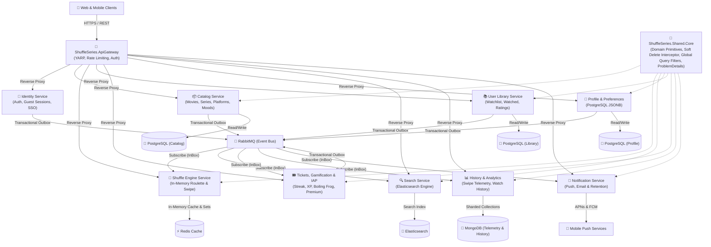

# 🎬 ShuffleSeries.Microservices

ShuffleSeries is a distributed, high-performance, and resilient microservices platform designed to provide smart, randomized content selection ("shuffle") across movies, series, and standalone episodes (such as *Black Mirror* or *Love, Death & Robots*).

Built with **.NET 10** and **C# 14**, the platform adheres to **Clean Architecture (Onion Architecture)**, **Domain-Driven Design (DDD)**, **CQRS**, and **Event-Driven Architecture**.

---

## 🏛️ System Architecture

The following diagram illustrates the high-level architecture and communication patterns across ShuffleSeries services:



---

## 🔄 Closed-Loop Event Choreography Matrix

ShuffleSeries leverages a decentralized **Event Choreography** pattern over RabbitMQ. To eliminate distributed data inconsistencies and temporal coupling:
- **Publishers** commit domain events alongside their transactional state using the **Transactional Outbox Pattern**.
- **Consumers** process incoming messages with idempotency guarantees using the **InBox Pattern**.
- Every published event has explicit, purposeful consumers—guaranteeing a **closed-loop event matrix** with zero orphaned events.

```mermaid
flowchart TD
    classDef pub fill:#1e293b,stroke:#38bdf8,stroke-width:2px,color:#fff;
    classDef evt fill:#0f172a,stroke:#fbbf24,stroke-width:1.5px,color:#fef08a;
    classDef sub fill:#1e293b,stroke:#4ade80,stroke-width:2px,color:#fff;

    subgraph FLOW_IDENTITY ["1️⃣ Identity & Account Lifecycle Stream"]
        direction LR
        P_ID["🔑 Identity Service\n(Outbox Publisher)"]:::pub -->|"Publishes"| E_ID["UserRegisteredEvent\nUserMergedEvent\nUserAccountDeletedEvent"]:::evt
        E_ID -->|"InBox"| C_ID1["🔔 Notification (Welcome Email)"]:::sub
        E_ID -->|"InBox"| C_ID2["🎟️ Tickets & Gamification (Init 14d Quota)"]:::sub
        E_ID -->|"InBox"| C_ID3["👤 Profile (Create Initial Profile)"]:::sub
        E_ID -->|"InBox"| C_ID4["📚 User Library (Merge Guest Watchlist)"]:::sub
        E_ID -->|"InBox"| C_ID5["📊 Analytics (GDPR Anonymization)"]:::sub
    end

    subgraph FLOW_CATALOG ["2️⃣ Content Catalog & Metadata Synchronization Stream"]
        direction LR
        P_CAT["📦 Catalog Service\n(Outbox Publisher)"]:::pub -->|"Publishes"| E_CAT["MediaCreated / Updated / Deleted\nPlatformUpdatedEvent\nMoodUpdatedEvent"]:::evt
        E_CAT -->|"InBox"| C_CAT1["🎲 Shuffle Engine (Redis Cache Sync)"]:::sub
        E_CAT -->|"InBox"| C_CAT2["🔍 Search Service (Elasticsearch Index)"]:::sub
        E_CAT -->|"InBox"| C_CAT3["🔔 Notification (New Media Push)"]:::sub
    end

    subgraph FLOW_SWIPE ["3️⃣ Swipe Arena & Real-Time Action Stream"]
        direction LR
        P_SHUF["🎲 Shuffle Engine\n(Outbox Publisher)"]:::pub -->|"Publishes"| E_SWIPE["ShuffleSwipedEvent\n(Action: Skip / Save, DwellTime)"]:::evt
        E_SWIPE -->|"InBox"| C_SWP1["🎟️ Tickets (Deduct 1 Ticket on Skip)"]:::sub
        E_SWIPE -->|"InBox"| C_SWP2["📊 Analytics (Dwell Time & Swipe Log)"]:::sub
    end

    subgraph FLOW_LIBRARY ["4️⃣ User Library, Watch & Rating Stream"]
        direction LR
        P_LIB["📚 User Library\n(Outbox Publisher)"]:::pub -->|"Publishes"| E_LIB["MediaAddedToWatchlistEvent\nMediaWatchedEvent\nMediaRatedEvent (3-State)"]:::evt
        E_LIB -->|"InBox"| C_LIB1["🎟️ Tickets (+3 Tickets per 3 Ratings)"]:::sub
        E_LIB -->|"InBox"| C_LIB2["🔍 Search (Trending Roulettes Count)"]:::sub
        E_LIB -->|"InBox"| C_LIB3["📊 Analytics (Watch History & Recs)"]:::sub
    end

    subgraph FLOW_PREMIUM ["5️⃣ Gamification & Premium Subscription Stream"]
        direction LR
        P_GAM["🎟️ Tickets & Gamification\n(Outbox Publisher)"]:::pub -->|"Publishes"| E_GAM["UserSubscribed / Cancelled\nBadgeUnlocked / LevelUp\nTicketBalanceExhausted"]:::evt
        E_GAM -->|"InBox"| C_GAM1["🎲 Shuffle Engine (Redis Premium Unlock)"]:::sub
        E_GAM -->|"InBox"| C_GAM2["🔔 Notification (Badge & VIP Push)"]:::sub
        E_GAM -->|"InBox"| C_GAM3["👤 Profile (Update Active Title)"]:::sub
        E_GAM -->|"InBox"| C_GAM4["📊 Analytics (IAP Conversion Telemetry)"]:::sub
    end

    subgraph FLOW_PROFILE ["6️⃣ User Preferences Invalidation Stream"]
        direction LR
        P_PROF["👤 Profile Service\n(Outbox Publisher)"]:::pub -->|"Publishes"| E_PROF["ProfileUpdatedEvent\n(Genres / Platforms Changed)"]:::evt
        E_PROF -->|"InBox"| C_PROF1["🎲 Shuffle Engine (Invalidate Cached Pool)"]:::sub
    end
```



### 📋 Event Choreography Routing Matrix

| Stream / Pipeline | Publisher (Outbox) | Published Domain Events | InBox Consumers (Subscribers) | Architectural Function |
| :--- | :--- | :--- | :--- | :--- |
| **1. Identity & Auth** | `Identity Service` | `UserRegisteredEvent`<br>`UserMergedEvent`<br>`UserAccountDeletedEvent` | • `Notification Service`<br>• `Tickets & Gamification`<br>• `Profile Service`<br>• `User Library`<br>• `History & Analytics` | Onboarding lifecycle, welcome emails, 14-day honeymoon quota allocation, guest session data merge, and GDPR right-to-be-forgotten cleanup. |
| **2. Catalog & Metadata** | `Catalog Service` | `MediaCreated/Updated/Deleted`<br>`PlatformUpdatedEvent`<br>`MoodUpdatedEvent` | • `Shuffle Engine`<br>• `Search Service`<br>• `Notification Service` | Instant Redis memory-set synchronization, Elasticsearch index updates with platform/mood facets, and push alerts for favorite genres. |
| **3. Swipe Arena** | `Shuffle Engine` | `ShuffleSwipedEvent` | • `Tickets & Gamification`<br>• `History & Analytics` | Real-time asynchronous ticket deduction on pass/skip without blocking the UI, plus dwell-time telemetry logging. |
| **4. User Library** | `User Library` | `MediaAddedToWatchlist`<br>`MediaWatchedEvent`<br>`MediaRatedEvent` | • `Tickets & Gamification`<br>• `Search Service`<br>• `History & Analytics` | Awarding +3 tickets on every 3 ratings, updating "Trending Roulettes" daily counts, and chronological watch history tracking. |
| **5. Gamification & IAP** | `Tickets & Gamification` | `UserSubscribed/Cancelled`<br>`BadgeUnlockedEvent`<br>`LevelUpEvent`<br>`TicketBalanceExhausted` | • `Shuffle Engine`<br>• `Notification Service`<br>• `Profile Service`<br>• `History & Analytics` | Real-time Redis entitlement caching (unlocking "My-List Shuffle" and VIP Arenas), celebration badge push notifications, and revenue analytics. |
| **6. Profile & Settings** | `Profile Service` | `ProfileUpdatedEvent` | • `Shuffle Engine` | Immediate invalidation of pre-computed in-memory shuffle pools when user changes platforms or genres. |

---

## 🧩 Solution Structure

```
├── ShuffleSeries.Shared.Core/          # Reusable foundational library for all microservices
│   ├── ShuffleSeries.Shared.Core.Domain/          # BaseEntity, AggregateRoot, Domain Events, Repositories
│   ├── ShuffleSeries.Shared.Core.Exceptions/      # CustomException hierarchy (Business, NotFound, Conflict, etc.)
│   ├── ShuffleSeries.Shared.Core.Application/     # Common DTOs (ApiResponse, PaginationRequest, PaginatedList)
│   ├── ShuffleSeries.Shared.Core.Infrastructure/  # EF Core Interceptors (Outbox messaging)
│   ├── ShuffleSeries.Shared.Core.Web/             # RFC 9457 GlobalExceptionHandler, ProblemDetails
│   └── ShuffleSeries.Shared.Core.Tests/           # Unit test suite for shared core primitives
├── ShuffleSeries.Catalog/              # Catalog bounded context
│   ├── ShuffleSeries.Catalog.Domain/
│   ├── ShuffleSeries.Catalog.Application/
│   ├── ShuffleSeries.Catalog.Infrastructure/
│   ├── ShuffleSeries.Catalog.Api/
│   └── ShuffleSeries.Catalog.Tests/
├── ShuffleSeries.ApiGateway/           # YARP-based intelligent API Gateway
└── docs/                               # Architectural documentation, roadmaps, and task guides
    ├── roadmap.md                      # Milestone & task tracking
    ├── lessons.md                      # Knowledge base of architectural decisions & lessons learned
    └── tasks/                          # Educational documentation for each milestone task
```

---

## 🛠️ Technology Stack

| Category | Technology |
| :--- | :--- |
| **Framework & Language** | .NET 10, C# 14 |
| **Architecture** | Onion Architecture, Domain-Driven Design (DDD), CQRS |
| **API & Networking** | Minimal APIs, YARP API Gateway, gRPC |
| **Event Streaming** | RabbitMQ (Outbox & InBox patterns for guaranteed delivery) |
| **Databases & Stores** | PostgreSQL, MongoDB, Redis, Elasticsearch |
| **Resilience** | Polly (Retry, Circuit Breaker, Fallback) |
| **Observability** | OpenTelemetry, Serilog, Prometheus, Jaeger |
| **Testing** | xUnit, FluentAssertions, Moq, Coverlet |

---

## 🧱 Shared.Core Building Blocks

`ShuffleSeries.Shared.Core` provides enterprise-grade abstractions across every microservice:

### 1. Domain Primitives (`ShuffleSeries.Shared.Core.Domain`)
- **`BaseEntity<TId>` & `BaseEntity`**: Identity-based equality, operator overloads (`==`, `!=`), audit fields, and built-in `ISoftDeletable` and `IHardDeletable` implementations.
- **`ISoftDeletable`**: Domain contract defining `IsDeleted`, `DeletedAtUtc`, `DeletedBy`, and domain-driven soft delete operations.
- **`IHardDeletable`**: Dedicated interface for explicit physical hard-delete intent (`IsHardDeleteRequested`, `HardDelete()`).
- **`AggregateRoot`**: Encapsulates domain event publishing (`RaiseDomainEvent`, `ClearDomainEvents`).
- **`IDomainEvent`**: Core event contract for cross-boundary event propagation.

### 2. Standardized Exceptions (`ShuffleSeries.Shared.Core.Exceptions`)
- **`CustomException`**: Abstract base exception carrying `HttpStatusCode`, machine-readable `Code`, and human-readable `Title`.
- **`BusinessException`**: HTTP 422 for domain rule violations.
- **`NotFoundException`**: HTTP 404 for missing resources, with `(entityName, key)` formatting.
- **`ValidationException`**: HTTP 400 for FluentValidation failure dictionaries.
- **`ConflictException`**: HTTP 409 for duplicate key / conflicting states.
- **`UnauthorizedException` & `ForbiddenException`**: HTTP 401 and HTTP 403 access control exceptions.
- **`InternalServerException`**: HTTP 500 for internal server failures.

### 3. Production-Ready ProblemDetails (`ShuffleSeries.Shared.Core.Web`)
- **`GlobalExceptionHandler`**: ASP.NET Core `IExceptionHandler` implementation adhering to RFC 7807 and RFC 9457.
- **Observability**: Automatically enriches error responses with `traceId` (`Activity.Current?.Id ?? HttpContext.TraceIdentifier`).
- **Security by Design (OWASP API8)**: Masks sensitive internal stack traces in non-development environments while maintaining detailed structured logging.

### 4. Common DTOs (`ShuffleSeries.Shared.Core.Application`)
- **`PaginatedList<T>`**: Immutable, paginated result set with seamless `System.Text.Json` deserialization (`[JsonConstructor]`).
- **`PaginationRequest`**: Normalized query parameter object with safe boundary clamping.
- **`ApiResponse<T>` & `ApiResponse`**: Standardized response envelope model.

### 5. Infrastructure, Soft Delete & Hard Delete (`ShuffleSeries.Shared.Core.Infrastructure`)
- **`SoftDeleteInterceptor`**: EF Core `SaveChangesInterceptor` that intercepts entity deletions (`EntityState.Deleted`) and transforms them into soft-deleted state updates (`EntityState.Modified`) with UTC timestamps.
- **`HardDeleteScope`**: Ambient `AsyncLocal<bool>` scope (`using (HardDeleteScope.Begin())`) allowing explicit physical deletions (e.g. GDPR, Apple Account Deletion, Retention Purges) by bypassing the soft-delete interceptor cleanly.
- **Domain `HardDelete()`**: Entity-level intent marker (`entity.HardDelete()`) that instructs the interceptor to permit physical deletion of that specific entity instance.
- **`ModelBuilderExtensions`**: Dynamically registers Global Query Filters (`e => !e.IsDeleted`) across all `ISoftDeletable` entities via Expression Trees (supporting `.IgnoreQueryFilters()`).
- **`InsertOutboxMessagesInterceptor`**: Collects and serializes uncommitted aggregate domain events into the transactional `OutboxMessages` table atomically.

---

## 🚀 Getting Started & Testing

### Prerequisites
- [.NET 10 SDK](https://dotnet.microsoft.com/download)
- Docker & Docker Compose (for infrastructure containers)

### Build Solution
```bash
dotnet build
```

### Run All Unit & Integration Tests
```bash
dotnet test
```

### Run Shared Core Tests Only
```bash
dotnet test --filter "FullyQualifiedName~ShuffleSeries.Shared.Core.Tests"
```

---

## 🗺️ Roadmap & Progress
Track current and upcoming milestones in [docs/roadmap.md](./docs/roadmap.md).
Architectural guidelines and lessons learned are documented in [docs/lessons.md](./docs/lessons.md).
Task-specific guides and architectural rationale can be found in [docs/tasks/](./docs/tasks/).